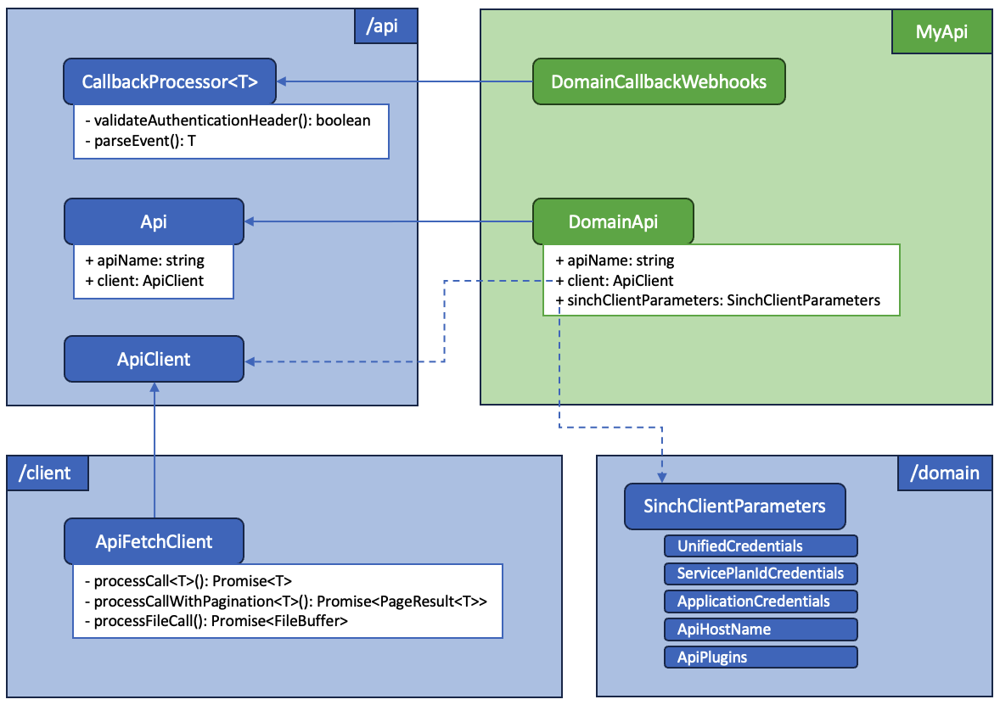

# Sinch Http Client for Node.js

This package contains the HTTP client used by the Sinch SDK client. It uses 2 third-party dependencies:
 - `node-fetch` to send requests.
 - `form-data` to manage "multipart/form-data" streams.

There are 5 folders in this package:
 - `api`: it defines the interface for an `Api`, an `ApiClient` and for `ApiClientOptions`.
 - `client`: it contains the `fetch` implementation for the `ApiClient`. This implementation handles the refresh of the JWT for the APIs which support this authentication method.
 - `domain`: it contains some Sinch-specific interfaces and enums used at domain level for authentication and region definition.
 - `plugins`: calling an API can be seen as a straighforward operation as it's "just" about sending an HTTP request to a server and reading the response. And this is was the `ApiClient` does. However, all APIs don't behave the same and this is why we have introduced the request and response plugins:
   - request plugins will modify the request: for the moment, they are all about adding some headers (for authentication, for tracking the SDK usage).
   - response plugins will modify the response, e.g.: response content is checked and transformed into an exception if the content is empty.
 - `utils`: it contains some utility methods that are used by the API SDKs, such as the methods to validate headers are valid in a callback event request, or a method to convert text to hexadecimal for a UDH header 

## Architecture


## Installation

### With NPM

```bash
npm install @sinch/sdk-client
```

### With Yarn

```bash
yarn add @sinch/sdk-client
```

## Usage

In this section, we'll see how to implement the `Api` interface and how to use the `ApiFetchClient` to call the API endpoint.

### Api interface

```typescript
export class MyExampleApi implements Api {
    public readonly apiName = 'MyExampleApi';
    public readonly client: ApiClient;

    constructor(apiClient: ApiClient) {
        this.client = apiClient;
    }

    public async myApiOperation(): Promise<Response> {
        // Define the API endpoint
        const url = `${this.client.apiClientOptions.basePath}/myDomain`;
        // Build the request options: you can use the method 'prepareOptions' from the apiClient 
        // that will apply the request plugins onto the default built options
        const requestOptions: RequestOptions = await this.client.prepareOptions(...);
        // Send the request and apply the response plugins
        return this.client.processCall<Response>({
            url,
            requestOptions,
            apiName: this.apiName,
        });
    }
}
```

### ApiFetchClient instantiation
```typescript
const apiClientOptions: ApiClientOptions = {
  basePath: 'https://my-example-api-server.com',
  requestPlugins: [
    // Add here the plugins that will be executed before the request is sent
  ],
  responsePlugins: [
    // Add here the plugins that will be executed after the response is received and parsed
  ]
}

// Instantiate the API Client
const apiClient = new ApiFetchClient(apiClientOptions);
```

### API class instantiation

```typescript
// Once the API Client is intantiated, it can be given as a parameter to your API
const myApi = new MyExampleApi(apiClient);

// The API operations can now be invoked
const myResponse = await myApi.myApiOperation();
```


## Plugins

### Request plugins

| Plugin name          | Description                                                                                                                                                                                                                                                                                                             |
|----------------------|-------------------------------------------------------------------------------------------------------------------------------------------------------------------------------------------------------------------------------------------------------------------------------------------------------------------------|
| additional-headers   | Adds multiple headers to a request.                                                                                                                                                                                                                                                                                     |
| api-token            | Used for the SMS API with `servicePlanId`. It adds an `Authorization` header with the value of the API token as a `Bearer`.                                                                                                                                                                                             |
| basic-authentication | Alternative to the `oauth2` plugin: less secure and to be used for prototyping only. It adds an `Authorization` header to the request to perform a `Basic` authentication.                                                                                                                                              |
| oauth2               | Used by all the APIs that supports the `projectId` authentication scheme. If no token is available, it will make a query to the Sinch authentication server to get a new one, valid for 1 hour. Once a token is available, it will add a `Authorization` header to the request with the value fo the token as `Bearer`. |
| signing              | Used by the `Verification` and `Voice` APIs: it adds an `Authorization` header containing the signature of the request.                                                                                                                                                                                                 |
| version              | Add a `user-agent` header containing information such as the SDK version and the Node.js process version.<br>**Added by default to the ApiFetchClient**                                                                                                                                                                 |
| x-timestamp          | Add the current date in ISO format in the `x-timesstamp` header (used by the `signing` plugin).                                                                                                                                                                                                                         |

### Response plugins 

| Plugin name | Description                                                                                                                                   |
|-------------|-----------------------------------------------------------------------------------------------------------------------------------------------|
| exception   | Check the response content and converts it into an error if empty or if the status is not `ok`.<br>**Added by default to the ApiFetchClient** |
| timezone    | Patch some response properties which are identified as returned without a timezone by the server                                              |

## Contact
Developer Experience team: [devexp@sinch.com](mailto:devexp@sinch.com)
